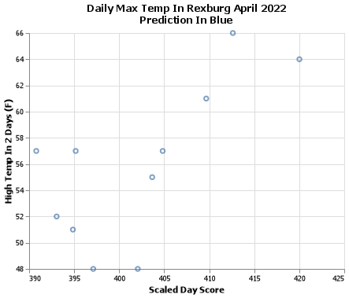
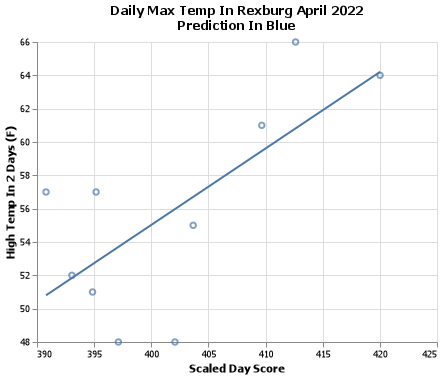
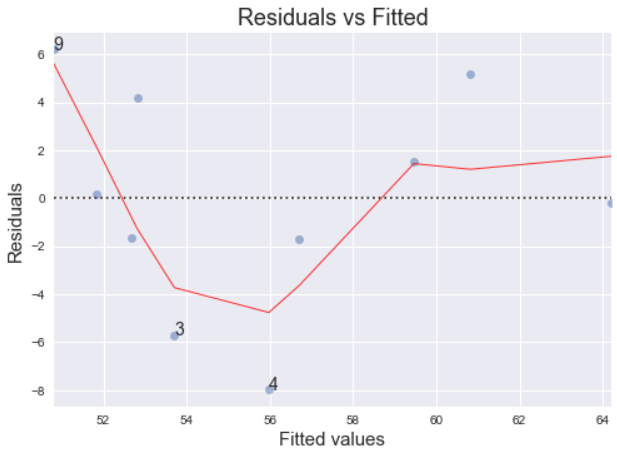
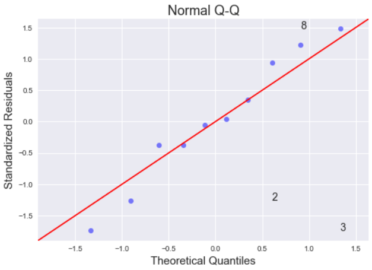

# Predicting The Weather On Saturday For Monday

| Day Score   | Prediction | 
| :---------: | :--------: | 
| 404.7       |    57      |  

## Premise of Analysis
This analysis was preformed as an introductory analysis to how a Linear Regression preforms. The question of this analysis was to see if we would be able to predict the weather on Monday April 25th 2022 on Saturday April 23rd 2022. With a prediction of 57, I looked at the prediction from other various weather sites and I saw an average of 56. So, as we dive deeper into the significance of this model, hopefully we find something promising. 

## Analysis Process
Starting off, data was manually gathered from timeanddate.com to create a custom data set. Data from the current week was retrieved and labeled as such. Then, data from the previous years at this same time was also found and collected. Then, a regression was performed on each of the variables and the target. Then, an equation was created with the following format.
$$
  \underbrace{\hat{Y}_i}_\text{Temp in 2 days} = \overbrace{b_0}^\text{est. y-int} + \overbrace{b_1}^\text{slope coefficient} \underbrace{X_i}_\text{column}
$$
The coefficient was retrieved for each of the regressions and stored in the table below. Generally speaking, the closer a slope is to 0, the less significance, or less correlation, the value has in it's relation to the predicted value. Positive means the line will look like this: / and negative means the line will look like this: \ .

| column           |      coefficient |
|:--------------|:---------:|
| air_pressure  | 12.0353   |
| precipitation |  4.5      |
| cloudy        |  1.83333  |
| w             |  1.22222  |
| lowtemp       |  0.855255 |
| hightemp      |  0.198092 |
| humidity      |  0.112986 |
| sw            | -0.166667 |
| windspeed     | -0.183599 |
| thisWeek      | -6.41667  |

## Final Model
After we found these coefficients, the columns were multiplied by their respective coefficients to scale the values, then they were all added up to create one variable I called the 'Scaled Day Score'. Each day in the data set has a unique score, then when plotted against the max temperature in days the chart below is formed:

From this chart we see a strong positive correlation. This gives us good hopes for our regression. After running the actual regression with `final_model = ols('temp2days ~ day_score',data = train).fit()`, a trend line appears as shown in the graphic below:

Before we go into the conclusion, lets take a look at the significance of our analysis. To start, we ended up with an RMSE value of 4.8, or in other words, we are confident that our guess is within +-4.8 degrees, and a P value of .026 (the smaller the number the more "significant" the results are). There are also some info graphics that can be examined to help us determine if our analysis is credible. 

### Residuals vs Fitted
The first chart is called 'Residuals vs Fitted' or RVF. What we are looking for in the chart is a good constant variance between the points. We wouldn't want a chart where all of the dots fall on the dashed line. With that in mind, this chart looks pretty good. 

### QQ Plot
Unlike the RVF plot, the QQ plot is supposed to stay close to the red line, the less variance the better. There does seem to be a little variance around the line, but it appears to be ok. 

## Conclusion
With the charts looking good, p value being < .05 and a decent RMSE score, I would say our analysis could use some improvements, but for using less than 10 points, is pretty good. So, with that being said, when we look at the day score for Saturday we have 404 and when we plug that into our regression we get a predicted max temp of 57 degrees Fahrenheit. Below, our predicted value can be seen as the blue dot and the equation for the line is listed below:

$$
  \underbrace{57}_\text{Temp in 2 days} = \overbrace{-128.4}^\text{est. y-int} + \overbrace{0.4586}^\text{slope coefficient} (\underbrace{404.7}_\text{day score})
$$
