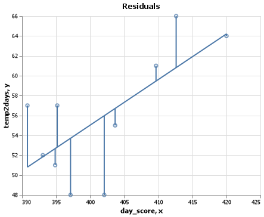
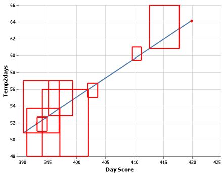
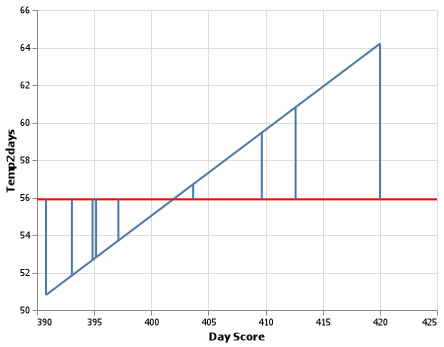
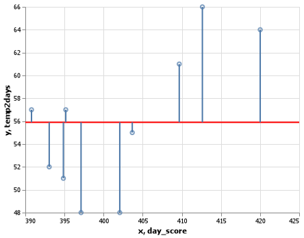
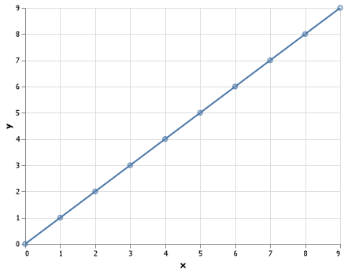
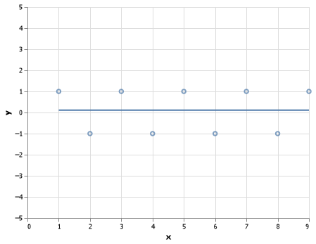

# Residuals, SSTO, SSR, SSE, and R-squared
### Ben Fuqua

## Intro
In the realm of statistics we have summary statistics that are used to view the fit of the model to the data. Some of these statistics can also be viewed in graphical form and the rest are proportions of the others. Today, we will be talking about only 5 of them. The data I will be using is data I scraped myself from a weather website to help predict the weather 2 days in advance. We will be comparing the max temperature 2 days into the future, explained by what I call a 'day score'. This score is a weighted sum of many different values like air pressure, wind speed, wind direction, etc. 

## Residuals
$$  r_i = \underbrace{Y_i}_{\substack{\text{Observed} \\ \text{Y-value}}} - \underbrace{\hat{Y}_i}_{\substack{\text{Predicted} \\ \text{Y-value}}} $$
The simplest place to start would be with the residuals, because residuals are the foundation of everything else we will talk about. Above is a plot where the blue line is our regression and the blue points are the actual data points. The red line represents the residuals. The residual is nothing more than the difference between the observed value ${Y_{i}}$ and what was predicted $\hat{Y_{i}}$. The residual is denoted by the value $r_i$ and the equation: 

The residuals have many uses within an analysis. The one we will focus on today is assessing the fit of the regression analysis to the rest of our data.

## Assessing The Fit
Earlier, when we talked about diagnostic plots and how they help us assess the quality of our analysis, those plots are built off of the residuals. Today, we will be talking about SSE, SSR, SSTO, and $R^2$. 

### Sum of Squared Errors 
$$\text{SSE} = \sum_{i=1}^n \left(Y_i - \hat{Y}_i\right)^2$$
Above, is the equation for the Sum of Squared Errors or SSE for short. This symbol $\sum_{i=1}^n$ may seem confusing, but it is saying take each data point (i) and plug it into the equation, square your answer, then add up all of the points you have i -> n number of samples. So, it is the sum of all of your residuals (errors) squared. To help us visualize this better, look at the graphic below. As you can see, it is literally the sum of squares. The area of a square is $L^2$ or $Residual^2$, so we are just adding up the area of each of the squares you see below. *NOTE: They do not look like squares because the x and the y axis are not on the same scale*. 

### Sum of Squares Regression
$$\text{SSR} = \sum_{i=1}^n \left(\hat{Y}_i - \bar{Y}\right)^2$$
This assessment statistic is called Sum of Squares Regression  or SSR for short. Unlike the SSE, it has less to do with the actual points, and more to do with the actual line itself. This model takes the $\hat{Y}$ (the predicted y value) and subtracts if from $\bar{Y}$ or the mean of all of the predicted values. The red line below represents $\bar{Y}$ and the dark blue line represents $\hat{Y}$. This summary statistic is not something you want to minimize like the SSE. As the SSR value grows smaller, so does the slope of your line. Thus, meaning there may not be a real pattern between these two variables because all of your values are just a little above or a little below the mean. 

### Sum of Squares Total 
$$\text{SSTO} = \sum_{i=1}^n \left(Y_i - \bar{Y}\right)^2$$
The Sum of Squares Total is denoted by the function above. It is very similar to the SSR value, but instead of $\hat{Y}$ being compared to $\bar{Y}$ it is ${Y}_i$ being compared to $\bar{Y}$. Just like the SSR, the SSTO is not a value you want to minimize for the same reasons listed above. For both the SSTO and SSR, it's not necessarily GOOD if these numbers are big, but it is BAD if they are small. An interesting fact about the SSTO is that it is the sum of the SSE and SSR values, thus: $SSTO = SSE + SSR$. We can manipulate this equation to help us solve for one if give the other two. The three possible combinations are:
$$
SSTO = SSE + SSR 
\\
SSE = SSTO - SSR
\\
SSR = SSTO - SSE
$$

### $R^2$
$$
  R^2 = \frac{SSR}{SSTO} = 1 - \frac{SSE}{SSTO}
$$
$R^2$ is the last term in our list. As you can see from the equation above, it is a proportion of the SSR and SSTO values. The smallest an $R^2$ value can be is 0, with the biggest being 1, here's why. As a refresher:
$$
\text{SSR} = \sum_{i=1}^n \left(\hat{Y}_i - \bar{Y}\right)^2
\\
\text{SSE} = \sum_{i=1}^n \left(Y_i - \hat{Y}_i\right)^2
\\
\text{SSTO} = \sum_{i=1}^n \left(Y_i - \bar{Y}\right)^2
$$
So, if $R^2 = 1$ then that means $SSR = SSTO$ because $SSE = 0$. The SSE would be 0 if the points fell directly on the chart as they do in Chart A down below. Also, if $R^2 = 0$ then that means $SSR = 0$ because the points don't fall on the line, but the line falls directly on  the mean, $\bar{Y}$ as it is show in Chart B down below where $\bar{Y} = .11$

#### Chart A

#### ChartB

## Conclusion

Over all, there are many different ways to assess the fit of your model. Remember these 3 things:
- It is always better to have a low SSE value 
- Do not have a small SSR value
- Try to make your SSR = your SSTO, a.k.a. an $R^2$ value of 1
If you are able to remember these bullet points, you will be able to confidently assess whether or not your model is useful. Because we all know, *every model is wrong but some are useful*. 
