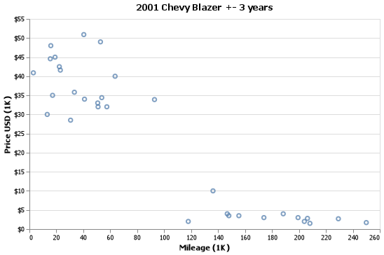
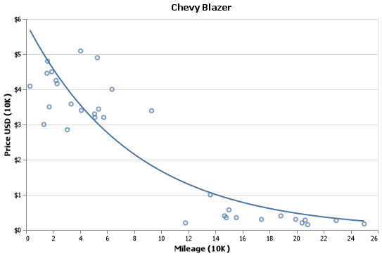
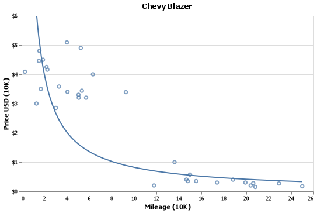
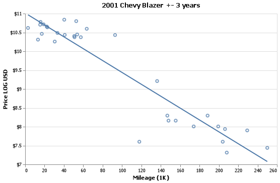
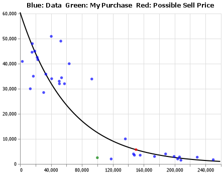
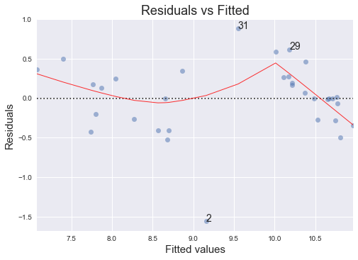
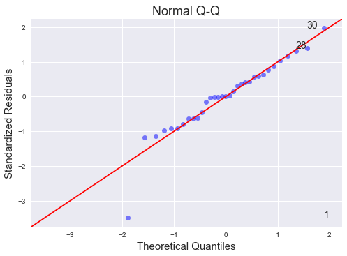
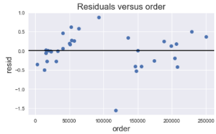

## Question

I bought my car back in 2015, a wonderful fire truck red Chevy Blazer! I bought it around 100K miles for $2500. How much would it be worth now, nearly 50K miles later in life? Well, according to this analysis, $5695. That's more than double what I bought it for!

## Data

The data used in this analysis was gathered from KSL. I looked at a wide range of vehicles ranging from 1998 through 2021 Chevy Blazers. Below is the top 5 rows of the data, and you can see which car is mine denoted in the i_bought column. 

|    | car          |   mileage |   price |   i_bought |
|---:|:-------------|----------:|--------:|-----------:|
|  1 | Chevy Blazer |    100000 |    2500 |          1 |
|  2 | Chevy Blazer |    146790 |    4000 |          0 |
|  3 | Chevy Blazer |    117871 |    2000 |          0 |
|  4 | Chevy Blazer |    136231 |   10000 |          0 |
|  5 | Chevy Blazer |    174000 |    3000 |          0 |

## Analysis

To start, the way cars lose value over time is not linear in any regard. There are so many factors that play into the value of a car namely mileage, age, outside appearance, title status, and so on. Today, we will only be focusing on mileage. It is important to note that right now, the cost of cars is a little high due to the low supply and high demand that has arisen from COVID-19. Because of this, my car will definitely be worth more, but by how much?

### How To Fit The Line?

When data isn't linear, you can transform the data through various ways to make it appear linear. One of these methods is through the log function. When you take the log of a value, it can shrink that value down into a much more manageable size. The smaller numbers don't really change a whole ton, but the bigger numbers lose a lot of value. 

Below, I have two graphs that were fitted with the afore mentioned transformation. Essentially, I bent the data so it was linear, fitted this line to it, then let the data 'fall back' into its original values. But, something interesting occurred. From the two lines that I was able to form, I could optimize in one area (ex: a good fit for the top left), but it would sacrifice in another (ex: Not a good fit for the bottom right). Due to the nature of this analysis being about predicting how much I could sell it for now, I chose to optimize for the bottom graph. 

### Regression
$$
  \underbrace{\hat{Y}_i}_\text{Estimated Sale Price} = \overbrace{11.01}^\text{est. y-int} - \overbrace{.00001575}^\text{coef} \underbrace{X_i}_\text{mileage})
$$

After preforming the transformation, we get this line with its accompanying function above it. Essentially what this is equation is telling us is that the average sale price of a vehicle goes down .00001 log USD for every 1 mile driven. This doesn't tell us much because we can't do simple math in our head to convert this equation back into normal USD. Currently we have this equation: $ \log(\hat{Y}_i) = 11.01 - .00001575 X_i$. To convert this equation from log USD back to plain USD we need to take the $e$ of both sides like so: $e^{log(\hat{Y}_i))} = e^{11.01 - .00001575 X_i}$ thus giving us $\hat{Y}_i = e^{11.01 - .00001575 X_i}$. 

### Prediction 

$$\$5695.89 = e^{11.01 - .00001575(150000)}$$

So, when we plug in 150,000 miles into this equation we get $5695.89 = e^{11.01 - .00001575(150000)}$. How amazing in that! Little did I know, my little blazer has more than doubled in value according to this model! But how accurate is it?

### Model Evaluation
Let's start by looking at some summary statistics (keep in mind these statistics are based off of the log of the price data):

| Metric   |   Value |
|:---------|--------:|
| MSE      |    0.21 |
| RMSE     |    0.46 |
| SSE      |    6.36 |
| SSR      |   47.15 |
| SSTO     |   53.51 |
| R^2      |    0.88 |
| RSE      |    0.46 |

Based off of these statistics, I would say our model is fitted very well to the data. Which we can see from the trend line up above. Now, what about the diagnostic plots?

### Plots
Below, we have our residuals vs fitted plot and there is a trend towards the end of the of the plot but it is because of the way the data was collected. Car websites organize their data in such a way that the cars at the beginning and the end are more catered towards your search history. These points I collected only from the top 15-20 cars that popped up first to demonstrate this point.

Below, the QQ plot looks fine, except for the first record in the data. This is expected as the first record is my own purchase back in 2015, so it would make sense why the residual who be so far off becuase it is data from 7 years ago. 

Here we have the residuals vs order plot and we do see a similar trend from the residuals vs fitted plot, so that confirms my theory about the way car sales websites show you their content. 

## Conclusion
Overall, I would say this analysis and its assumptions look ok. There are some oddities in the analysis but we can explain them by random high prices, or the algorithm that generated the listings. This analysis has shown me that my car is worth WAY more than I initially thought, and I will be trying to sell my car ASAP.