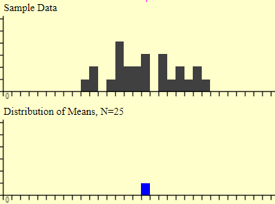
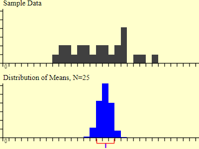
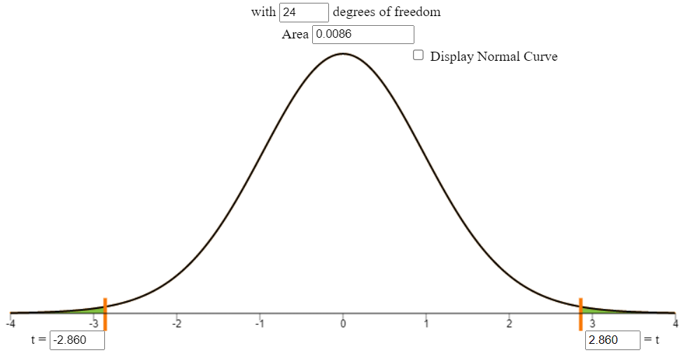

## Overview
Sampling distributions are very important to understand when you are performing an analysis. If we wanted to know if we could predict a random male's height based on age in Rexburg, it would be extremely hard and time consuming to collect every single data point. This is why we take samples of the population, and from those samples create sampling distributions. In this analysis, we will be exploring what a sampling distribution actually is, what the P-value means and what exactly a confidence interval means

### Sampling Distribution
$$
\underbrace{Y_i}_\text{Height} = \overbrace{\beta_0}^\text{y-int} + \overbrace{\beta_1}^\text{slope} \underbrace{X_i}_\text{Age} + \epsilon_i \quad \text{where} \ \epsilon_i \sim N(0, \sigma^2)
$$

Above is the true equation we would use to predict a male's height in Rexburg, with actual values for $\beta_0$ and $\beta_1$. We don't know these number because it is the true representation, and with analysis we hope to approximate what those values are. Let's say that we created our analysis to have a domain (x values) of 1-40 years old. We would then go out to various locations in Rexburg, ask for someone's age and height then record it. From that data we discovered the equation $\underbrace{y_i}_\text{Height} = \overbrace{21.7}^\text{y-int} + \overbrace{3.17}^\text{slope} \underbrace{X_i}_\text{Age}$. But this is only one sample, can we trust it? This is where sampling distributions come into play. 

Each estimate ($b_0,b_1$) has its own sampling distribution. From here on out I will only reference $b_1$ but just know that the same principle applies to $b_0$. Since $b_1$ is an estimate, it will have a slightly different value and standard deviation from sample to sample, even though $\beta_1$ remains a constant. The equation for the sampling distribution for $b_1$ is as follows:
$$
  \sigma^2_{b_1} = \frac{\sigma^2}{\sum(X_i-\bar{X})^2}
$$

This equation shows us the variation of the sample distribution of $b_1$, A.K.A. what we expect all values of $b_1$ to fall within. This equation shows us the variation ($\sigma^2$) divided by the summation ($\sum$) of each x value minus the mean ($\bar{x}|\mu$) squared. Let's take a look at this graphically:

Above is a graph that shows 25 samples of $X$ taken from a our given population. The blue rectangle represents our estimate of $\beta_1$ or it is our $b_1$ for this regression. This is our first sample out of a long list. The chart below is from the same distribution with the same number of samples, but this time we did 300 analyses to establish a distribution of our predicted $b_1$.

As you can see, the distribution of each $b_1$, or the sampling distribution helps us to accurately describe the true value (middle of blue rectangles) or $\beta_1$ of our regression. You could say the estimation of the estimates is the truth. The red bracket above is called the variance of the sample distribution and when we take the square root of the variance we get the standard deviation or standard error ($s_{b_1}$).

### P-Values
With sampling distribution covered, let's dive into P-Values and how to find them. First off, the t-value is nothing more than taking our predicted $b_1$ or $b_0$ value and subtracting it from our $H_0$ value then dividing it by the variance of the standard error or in equation form: 

$$t = \frac{b_1 - \overbrace{0}^\text{a number}}{s_{b_1}}$$

Remember from above, our $b_1$ value was 3.17 and we had 25 samples in our analysis.  we will say our $H_0$ = 0 and our standard error is 1.07, our equation would now look like: $t = \frac{3.17 - 0}{1.72} = 2.96$. Now that we have a t value of .0011 we can plug it into a probability applet to get us the P-Value, which is nothing more than the area under the curve:

Think of the P-Value like this: What is the probability that my prediction is not close to my hypothesized value, based on my standard deviation (standard error). So, for us, the probability our value is close to zero is .86%. As you can see, the standard error plays a big part in determining the P-Value, if our standard error was 2.5 our new equation would be $t = \frac{3.17 - 0}{2.5} = 1.47$ and we would get a P-Value of .1546 or 15.46%. But how do we determine if one, both, or none of these P-Values are significant? That question bring us to confidence intervals.

### Confidence Intervals

$$
  b_1 \pm t^*_{n-2}\cdot s_{b_1}  \\
  b_0 \pm t^*_{n-2}\cdot s_{b_0}
$$

The two most common types of confidence intervals are 95% and 99%. For now, we will only focus on 95%. We use confidence intervals all the time in normal speech, you may just not realize. Consider this "I'll be there in 1 hour, plus minus 5 minutes". This would be the equivalent of an 85% confidence interval, or in other words "I am 85% confident that we will be there in 55 minutes to 65 minutes. Now, to convert that to our analysis is by saying "We are 95% confident that the true value will fall within -'range' and 'range'". Above is the equation used to derive the confidence interval (CI) for $b_1$ and $b_0$. In english we would say "$b_1$ (slope) plus minus the critical value of t (a cutoff point for any given confidence interval) multiplied by the standard error". So, for our $b_1$ value our equation would look like:

$$
  3.17 \pm 1.96\cdot 1.72 \\
  = -.2 \\
  = 6.37
$$

Thus, we are 95% confident (or that 95% of the time):

$$ -.2 < \beta_1 > 6.37$$

Now that we have chosen our confidence intervals we can evaluate our P-Value. If:

$$ 
    1-CI > P-Value \\
    1-.95 > .0086
$$

Then our analysis is significant enough to accept the results as fact. 

## Conclusion

We have covered a lot of material in this section, so here is a recap:

- Everything discussed here applies to $b_0$ AND $b_1$. 
- The sampling distribution is the distribution of multiple estimates from the same distribution "the estimate of the estimations is the true estimate"
- P-Values give you the significance of your analysis, based on your confidence interval
- We are CI% sure that the true $\beta_0$/$\beta_1$ lies within their respective range.